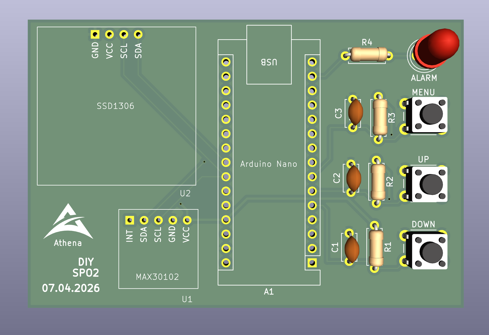
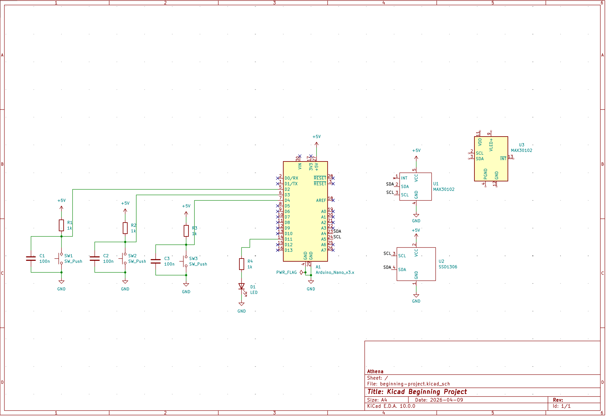
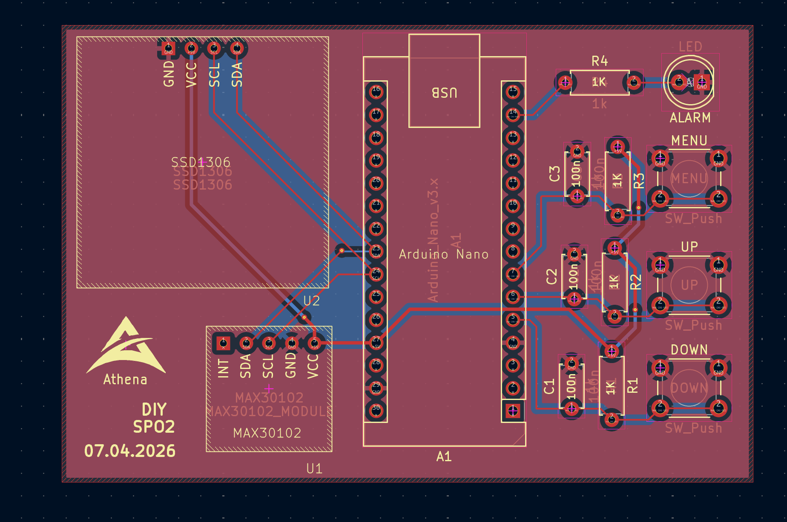

# My First KiCad Project

This repository contains my very first PCB design using KiCad EDA. It was created as a learning project to understand the complete hardware design workflow, from schematic capture to generating production-ready Gerber files.

##  Project Details

- **EDA Tool:** KiCad
- **Board Type:** 2-Layer Printed Circuit Board (PCB)
- **Status:** Designed & Routed (Gerber files generated)

### Key Achievements
1. **Schematic Design:** Successfully mapped out the circuit logic and connections from scratch.
2. **Custom Libraries:** Created custom schematic symbols and PCB footprints (`spo2_stuff`) for components not available in the standard KiCad library.
3. **PCB Routing:** Manually completed component placement and routed all copper traces for a 2-layer board layout.
4. **Manufacturing Export:** Generated standard, ready-to-manufacture Gerber and Drill files.

---

## Visual Showcase

| 3D Render | Schematic | PCB Layout |
|:---:|:---:|:---:|
|  |  |  |

---

## Repository Structure

* `*.kicad_sch` — Schematic source file.
* `*.kicad_pcb` — PCB layout design file.
* `spo2_stuff*/` — Custom symbol and footprint libraries designed specifically for this project.
* `gerbers/` — Fabrication output files ready for actual manufacturing.

---

*If you have any feedback or tips for a beginner hardware designer, feel free to open an issue or reach out!*
